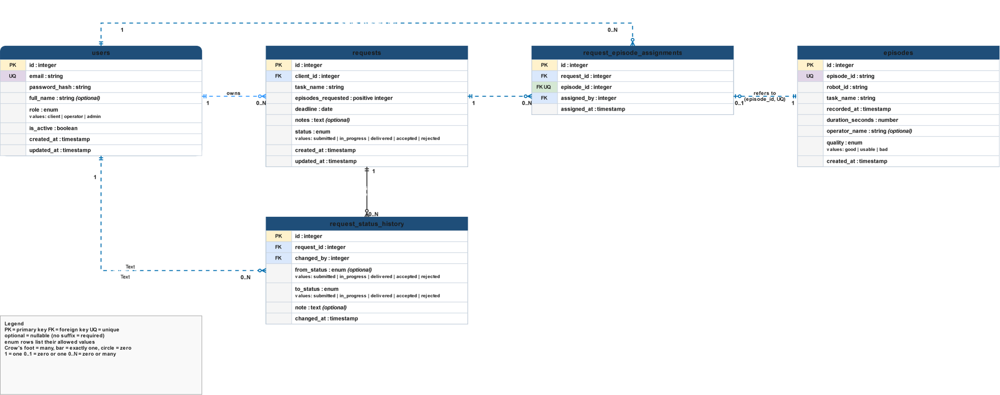

# Engineering notes

## 1. Design

- **Data model:** users own dataset requests; requests are linked to episodes through assignments; status history records each transition, actor, time, and optional rejection feedback. Episode IDs are unique for safe repeat imports.
- **State:** PostgreSQL is the production source of truth. The current request status is stored on the request and each change is recorded in history. JWTs identify callers; the API checks role and ownership against the database.
- **Hard decisions:** (1) keep both current status and history, so queues are simple to query and transitions remain auditable; (2) skip invalid/duplicate CSV rows individually and report line-level reasons, so one bad row does not block a safe re-import; (3) use PostgreSQL for production constraints and concurrency, with SQLite only in isolated tests.

## 2. Simplifications and next steps

- The request queue and available-episode chooser are not fully paginated; CSV imports are processed in memory. There is no real-time update channel, export-job pipeline, notification delivery, or password reset.
- With two more days: paginate/filter those large lists, move large imports to streaming/background work, add rate limiting, and add browser end-to-end coverage.

## 3. What went wrong

- Protected API calls returned 401 after login. Network inspection showed the shared API helper was sending a placeholder instead of the bearer token; correcting the `Authorization` header fixed the flow.
- On Render, the bundled CSV lookup failed because the installed package location differed from the repository path. I changed seed/generator lookup to use the service working directory, with environment-variable overrides.

## 4. Security

- Passwords use bcrypt; short-lived JWTs authenticate requests. The API enforces roles and request ownership, validates request/CSV input, and the database enforces assignment uniqueness and foreign keys. Production secrets are environment settings or private service files; only the public API URL is exposed to the frontend.
- Main risks: **token theft/XSS** (HTTPS, restrictive CSP, short expiry; consider secure HttpOnly cookies) and **broken object-level authorization/IDOR** (test ownership checks on every route). Rotate the Neon database password shared during deployment troubleshooting and update Render's `DATABASE_URL` before submission.

## 5. Scale

- At 10x users: login abuse, queue contention, and weak observability become concerns; add distributed rate limits, metrics/tracing, and workload-based indexes.
- At 100x episodes (about five million): broad reads and in-memory imports are likely to fail first. Add cursor pagination, streaming/background imports, inspect query plans and indexes, and consider partitioning or precomputed daily aggregates. Analytics already aggregate in SQL.

## 6. AI tooling

- GitHub Copilot CLI helped inspect the code, implement changes, and draft test cases. Codex helped diagnose token handling and work on bulk assignment and client review flows. I reviewed the generated changes against the project requirements.

## Deployment stretch: HTTPS deployment

- **Frontend:** [Vercel](https://data-desk-frontned.vercel.app/). **API:** [Render](https://data-desk-backend.onrender.com/), with [health](https://data-desk-backend.onrender.com/health) and [Swagger UI](https://data-desk-backend.onrender.com/docs). The deployment URLs use HTTPS.
- **Database:** Neon PostgreSQL. Render stores `DATABASE_URL` and `JWT_SECRET_KEY` as service secrets; they are not committed or sent to the browser. The frontend uses `NEXT_PUBLIC_API_BASE_URL`, which contains only the public API URL. Backend CORS allows the deployed frontend origin, and Alembic applies migrations at startup.
- Production seed credentials are supplied privately through Render configuration. Free-tier services can sleep when idle, so the first request may be delayed.
